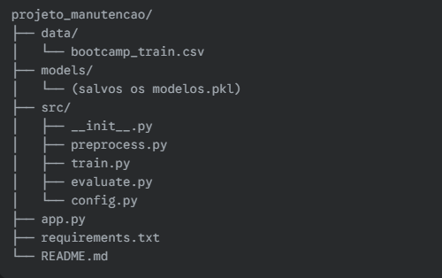
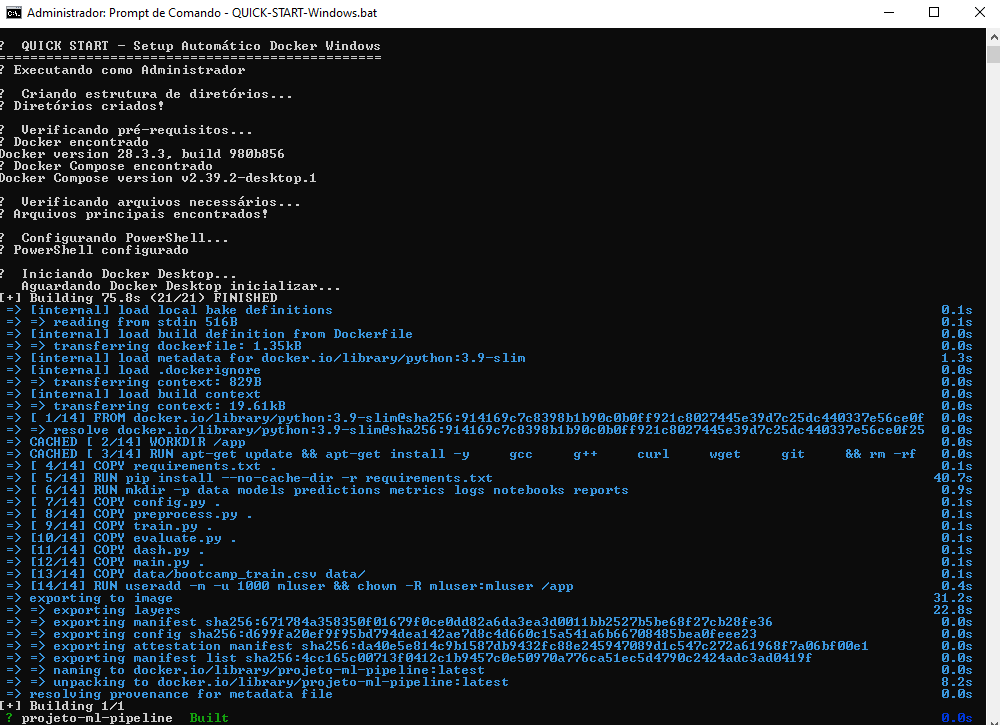
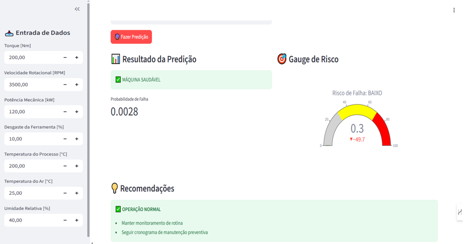

# 🔧 Manutenção Preditiva com Machine Learning

Projeto desenvolvido como parte do **Bootcamp de Ciência de Dados e IA**.  
O objetivo é construir um pipeline de ponta a ponta para prever **falhas em máquinas industriais** a partir de dados de sensores, possibilitando a atuação **proativa** da equipe de manutenção.

---

## 📊 Contexto do Negócio

Empresas industriais enfrentam custos elevados com **manutenção corretiva** e **paradas inesperadas** de produção.  
A manutenção preditiva, apoiada por **Machine Learning**, surge como solução estratégica para:

- 🚫 Reduzir o número de falhas inesperadas.  
- ⚡ Aumentar a eficiência e a vida útil dos equipamentos.  
- 📅 Otimizar o planejamento de paradas para manutenção.  
- 💰 Reduzir custos operacionais e de reparo.  

---

## 📖 Acesso Rápido

- [📂 Estrutura do Projeto](#-estrutura-do-projeto)  
- [🔧 Ferramentas](#-ferramentas)  
- [⚡ Pipeline Principal](#️-executar-o-pipeline-principal)  
- [📉 Percurso Analítico](#-percurso-analítico)  
  # Percurso Analítico

---

## 📂 Estrutura do Projeto

O código foi organizado de forma **modular**, garantindo clareza, escalabilidade e fácil manutenção.



---

# 🔧Ferramenta

## Como Executar o Projeto

Siga os passos abaixo para configurar o ambiente e executar o pipeline completo de treinamento e avaliação.


## ✅ Pré-requisitos

- Python **3.9 ou superior**  
- `pip` (gerenciador de pacotes do Python)  
---

## 📂 Clonar o Repositório

### A. Clona o repositório para uma pasta chamada "Bootcamp_US"
```bash
git clone https://github.com/LeonardoCorreia08/Bootcamp_US.git
```
### B. Entra na pasta que acabou de ser criada
```
cd Bootcamp_US
```
## Passos para Execução
```
Criar um Ambiente Virtual (Recomendado)
```
### Cria o ambiente virtual
```
python -m venv venv
```
### Ativa o ambiente (Linux/macOS)
```
source venv/bin/activate
```
### Ativa o ambiente (Windows)
```
.\venv\Scripts\activate
```

### Instalar as Dependências
O arquivo requirement.txt contém todas as bibliotecas necessárias.
```
pip install -r requirement.txt
```
### Inicializar o Projeto

📌 Para rodar o pipeline completo, basta executar:
```bash
python main.py
```
✅ Pronto! O ambiente estará configurado e o projeto inicializado corretamente.

### Executar o Pipeline Principal

O script `main.py` é responsável por **orquestrar todo o pipeline de Machine Learning**.  
Ao executá-lo, as seguintes etapas são realizadas automaticamente, de forma sequencial:

1. **Configuração** – Carregamento dos parâmetros do projeto.  
2. **Pré-processamento** – Limpeza, transformação e balanceamento dos dados.  
3. **Treinamento** – Treino do modelo de Machine Learning definido.  
4. **Avaliação** – Cálculo das métricas de performance (Accuracy, F1, etc.) e geração de relatórios.  
5. **Persistência** – Salvamento do modelo final em `models/` para uso futuro (API, dashboards, etc.).

✅ Isso garante que todas as etapas — configuração → pré-processamento → treino → avaliação → salvamento — sejam executadas em um único fluxo contínuo.

---

### Docker
Docker é uma plataforma de contêinerização que permite criar, implantar e executar aplicativos em contêineres. É amplamente utilizado para garantir que os ambientes de desenvolvimento e produção sejam consistentes.

- **Principais Características**: Portabilidade, consistência de ambiente, isolamento de aplicativos.
- **Casos de Uso**: Implantação de aplicações, isolamento de ambientes de desenvolvimento.
- **Links**:
- [Docker Official Site](https://www.docker.com/)
- [Docker Documentation](https://docs.docker.com/)

Se estiver utilizando Windows, você pode inicializar rapidamente com o script:
```
QUICK-START-Windows.bat
```




### 📊 Dashboard de Manutenção Preditiva - Streamlit

Este dashboard em **Streamlit** permite visualizar e interagir com o modelo de **Manutenção Preditiva**, aplicando predições e exibindo métricas de desempenho.
---
### Pré-requisitos

- Python **3.9 ou superior**
- `pip` instalado
- Dependências listadas no arquivo `requirements.txt`
---
### Como Executar o Dashboard

1. **Instale as Dependências**
Se ainda não tiver instalado as bibliotecas necessárias:
```bash
pip install -r requirements.txt
```
2. **Execute o Streamlit**
O arquivo principal da aplicação é o app.py.
Para iniciar o dashboard, basta rodar:
 ```
streamlit run app.py
 ```
3. **Acesse no Navegador**
Após iniciar, o Streamlit abrirá automaticamente em:
 ```
http://localhost:8501
 ```


### 📊 Dashboard de Integração com API

Este script (`dash.py`) conecta o modelo treinado à **API oficial do Bootcamp**, gerando predições no formato esperado e enviando para avaliação automática.
---
### Como Executar
No terminal, rode:
```bash
python dash.py
```

# 📉 Percurso Analítico

[Análise Exploratória](https://github.com/LeonardoCorreia08/Bootcamp_US/blob/main/resultado/Analise.md)

[Data Storytelling](https://github.com/LeonardoCorreia08/Bootcamp_US/blob/main/resultado/Data%20Storytelling.pdf)

[Online](https://colab.research.google.com/drive/1gHTJ6rKk-_u5WLWe8Mzz09vRgxUXg1bO#scrollTo=6pXKiTte9kXx&uniqifier=1)

[Relatório](https://github.com/LeonardoCorreia08/Bootcamp_US/blob/main/)

---
# 💻 Tecnologias Utilizadas
---

- **Linguagem**: Python  
- **Manipulação e Análise de Dados**: Pandas, Numpy  
- **Visualização de Dados**: Matplotlib, Seaborn  
- **Machine Learning / Modelagem**: Scikit-learn, Imbalanced-learn  
- **Análise Exploratória**: Ydata-profiling  
- **Persistência de Modelos**: Joblib, Pickle  
- **APIs e Deploy**: FastAPI, Uvicorn  
- **Dashboard**: Streamlit  
- **Ambiente e Automação**: Docker, GitHub Actions


## 📌 Versão

v1.0

## 📄 Licença

Este projeto está sob licença

<a>
<div align="right">Desenvolvido por Leonardo Correia </a>.</div>
 </a>
