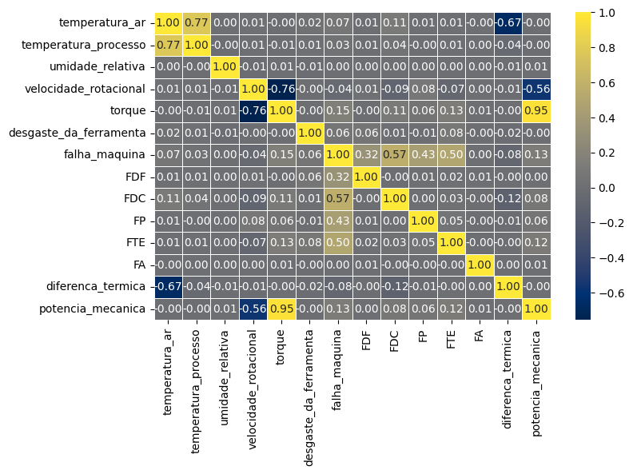
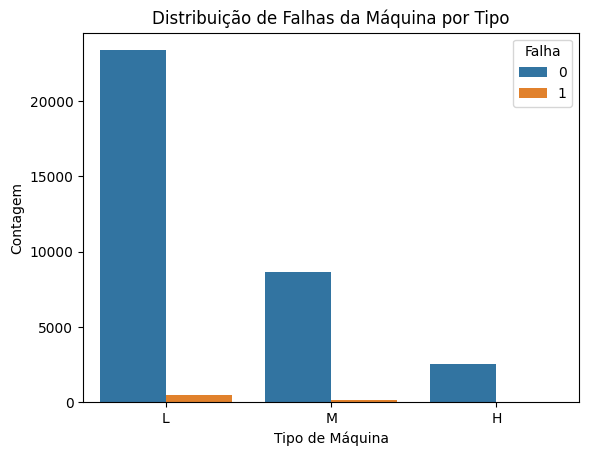
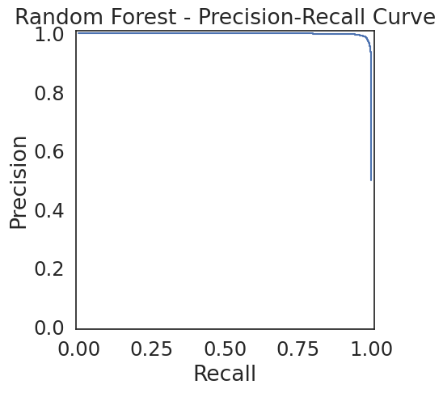
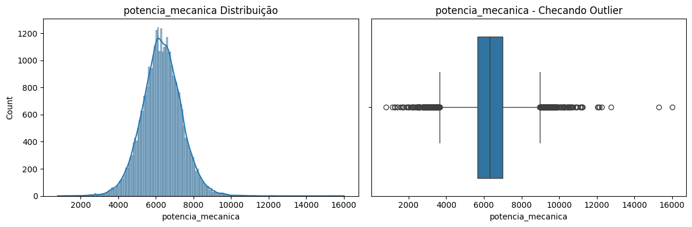
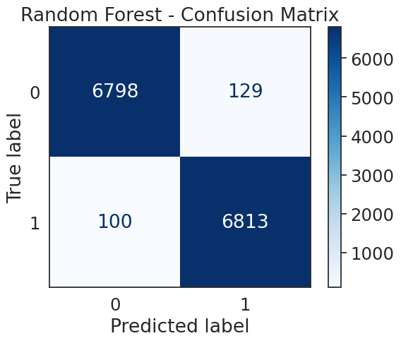
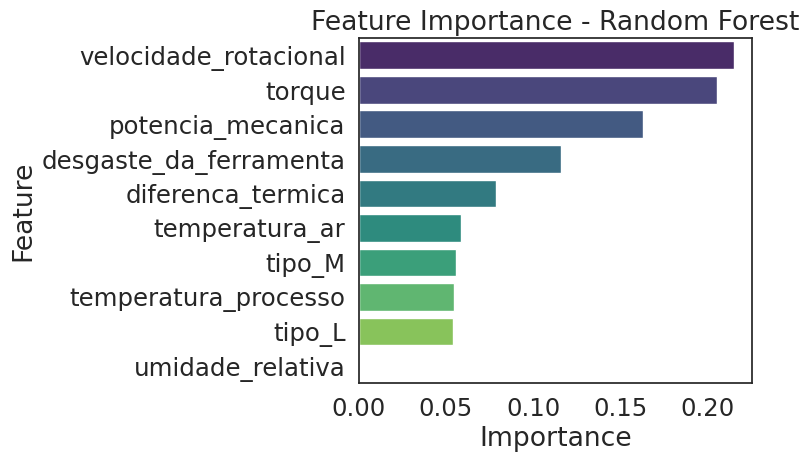

# 🛠️ Manutenção Preditiva com Machine Learning

Este projeto foi desenvolvido como parte do **Bootcamp de Ciência de Dados e IA**. O objetivo é construir um pipeline de ponta a ponta para prever **falhas em máquinas industriais** a partir de dados de sensores, permitindo a atuação proativa da equipe de manutenção.

---

## 📊 Contexto do Negócio

Empresas industriais enfrentam custos elevados com manutenção corretiva e paradas inesperadas de produção. A manutenção preditiva, com o apoio de **Machine Learning**, surge como uma solução estratégica para:

-   Reduzir o número de falhas inesperadas.
-   Aumentar a eficiência e a vida útil dos equipamentos.
-   Otimizar o planejamento de paradas para manutenção.
-   Reduzir custos operacionais e de reparo.

---

## 📂 Estrutura do Projeto

O código é organizado de forma modular para garantir clareza, manutenibilidade e escalabilidade.


---

## 🚀 Como Executar o Projeto

Siga os passos abaixo para configurar o ambiente e executar o pipeline completo de treinamento e avaliação.

### Pré-requisitos
* Python 3.8 ou superior
* `pip` (gerenciador de pacotes do Python)

### Passos para Execução

1.  **Crie um Ambiente Virtual (Recomendado)**
    ```bash
    # Cria o ambiente
    python -m venv venv

    # Ativa o ambiente (Linux/macOS)
    source venv/bin/activate

    # Ativa o ambiente (Windows)
    .\venv\Scripts\activate
    ```

2.  **Instale as Dependências**
    O arquivo `requirements.txt` contém todas as bibliotecas necessárias.
    ```bash
    pip install -r requirements.txt
    ```

3.  **Execute o Pipeline Principal**
    O script `app.py` orquestra todas as etapas: carrega os dados, pré-processa, treina o modelo, avalia e salva o artefato final na pasta `models/`.
    ```bash
    python app.py
    ```
    Ao final da execução, um relatório de performance e uma matriz de confusão serão exibidos no terminal.

---

## 🔬 Etapas Técnicas do Projeto

### 1. Análise Exploratória de Dados (EDA)

A primeira etapa consistiu em entender a fundo os dados. A análise revelou duas características principais: a forte correlação entre algumas variáveis de processo e, mais importante, o grande desbalanceamento entre as classes (poucos registros de falha).


*<p align="center">Mapa de calor mostrando a correlação entre as variáveis numéricas.</p>*


*<p align="center">Gráfico evidenciando o desbalanceamento de classes: há muito mais registros de "não falha" (0) do que de "falha" (1).</p>*

### 2. Modelagem e Comparação de Desempenho

Foram treinados e avaliados três modelos de classificação distintos: Árvore de Decisão, Bagging e Random Forest. A performance foi medida com foco principal no **F1-Score** devido ao desbalanceamento dos dados.

O modelo **Random Forest** apresentou a melhor performance geral, como mostra a tabela de resultados.


*<p align="center">Tabela comparativa com as métricas de desempenho para cada modelo testado.</p>*

### 3. Modelagem e Resultados
Foram testados diferentes algoritmos de classificação, com os modelos de *ensemble* apresentando os melhores resultados. A performance foi avaliada com foco no **F1-Score** devido ao desbalanceamento dos dados.

| Modelo          | F1-Score (Falha) |
|-----------------|------------------|
| 🌲 Random Forest | **0.9775** |
| 🧩 Bagging      | 0.9722           |
| 🌳 Decision Tree| 0.9582           |

#### Performance Detalhada

O relatório de classificação abaixo mostra que o modelo alcançou um **Recall de 0.93** para a classe "Falha", indicando que ele foi capaz de identificar corretamente 93% de todas as falhas reais. O **F1-Score de 0.98** demonstra um excelente equilíbrio entre precisão e recall.


*<p align="center">Relatório de Classificação detalhado para o modelo Random Forest.</p>*

A **Matriz de Confusão** confirma visualmente a baixa quantidade de erros, especialmente os Falsos Negativos (casos em que uma falha real não foi detectada), que são o tipo de erro mais crítico a ser evitado.


*<p align="center">Matriz de Confusão para o conjunto de teste.</p>*

O **Random Forest** foi selecionado como o modelo final por apresentar o melhor equilíbrio entre as métricas e sua robustez. As variáveis mais importantes para a previsão do modelo foram **Torque**, **Desgaste da Ferramenta** e a **Diferença de Temperatura** entre o processo e o ar.

#### Interpretabilidade do Modelo

A análise de **importância das features** revela que **Torque**, **desgaste da ferramenta** e **velocidade rotacional** foram os fatores mais decisivos para o modelo prever uma falha.


*<p align="center">As 10 variáveis mais importantes segundo o modelo Random Forest.</p>*

---

## ✅ Conclusões e Próximos Passos

O modelo desenvolvido se mostrou altamente eficaz em prever falhas, atingindo um **F1-Score de 0.9775**. A implementação deste sistema pode gerar grande impacto positivo, reduzindo paradas não planejadas, aumentando a segurança operacional e gerando economia em custos de manutenção.

**Próximos Passos para Evolução do Projeto:**
-   **Deploy do modelo** como uma API utilizando **FastAPI**.
-   Criação de um **Dashboard interativo** com Streamlit para monitoramento em tempo real.
-   Empacotamento da aplicação com **Docker** para facilitar o deploy em qualquer ambiente (nuvem ou on-premise).

---

## 💻 Tecnologias Utilizadas

-   **Linguagem**: Python
-   **Bibliotecas Principais**: Pandas, Numpy, Scikit-learn, Imbalanced-learn, Seaborn, Matplotlib.
-   **Análise Exploratória**: Ydata-profiling.
