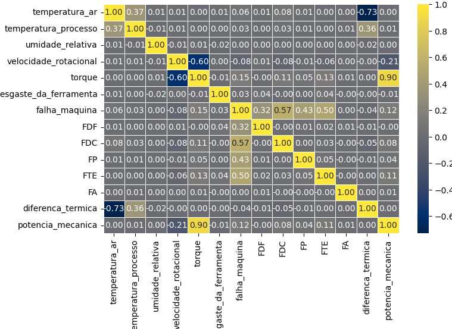
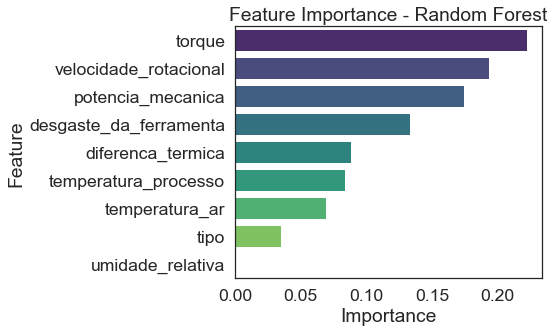

# 🔧 Manutenção Preditiva com Machine Learning

Projeto desenvolvido como parte do **Bootcamp de Ciência de Dados e IA**.  
O objetivo é construir um pipeline de ponta a ponta para prever **falhas em máquinas industriais** a partir de dados de sensores, possibilitando a atuação **proativa** da equipe de manutenção.

---

## 📊 Contexto do Negócio

Empresas industriais enfrentam custos elevados com **manutenção corretiva** e **paradas inesperadas** de produção.  
A manutenção preditiva, apoiada por **Machine Learning**, surge como solução estratégica para:

- 🚫 Reduzir o número de falhas inesperadas.  
- ⚡ Aumentar a eficiência e a vida útil dos equipamentos.  
- 📅 Otimizar o planejamento de paradas para manutenção.  
- 💰 Reduzir custos operacionais e de reparo.  

---

## 📖 Acesso Rápido

- [📂 Estrutura do Projeto](#-estrutura-do-projeto)  
- [🔧 Ferramentas](#-ferramentas)  
- [⚡ Pipeline Principal](#️-executar-o-pipeline-principal)  
- [📉 Percurso Analítico](#-percurso-analítico)  
- [✅ Conclusões e Próximos Passos](#-conclusões-e-próximos-passos)  

---

## 📂 Estrutura do Projeto

O código foi organizado de forma **modular**, garantindo clareza, escalabilidade e fácil manutenção.


---

# 🔧Ferramenta

## Como Executar o Projeto

Siga os passos abaixo para configurar o ambiente e executar o pipeline completo de treinamento e avaliação.


## ✅ Pré-requisitos

- Python **3.9 ou superior**  
- `pip` (gerenciador de pacotes do Python)  

---

## 📂 Clonar o Repositório


### A. Clona o repositório para uma pasta chamada "Bootcamp_US"
```bash
git clone https://github.com/LeonardoCorreia08/Bootcamp_US.git
```
### B. Entra na pasta que acabou de ser criada
```
cd Bootcamp_US
```
## Passos para Execução
```
Criar um Ambiente Virtual (Recomendado)
```
### Cria o ambiente virtual
```
python -m venv venv
```
### Ativa o ambiente (Linux/macOS)
```
source venv/bin/activate
```
### Ativa o ambiente (Windows)
```
.\venv\Scripts\activate
```

### Instalar as Dependências
O arquivo requirement.txt contém todas as bibliotecas necessárias.
```
pip install -r requirement.txt
```
### Inicializar o Projeto

Se estiver utilizando Windows, você pode inicializar rapidamente com o script:
```
QUICK-START-Windows.bat
```
✅ Pronto! O ambiente estará configurado e o projeto inicializado corretamente.


### Executar o Pipeline Principal

O script `main.py` é responsável por **orquestrar todo o pipeline de Machine Learning**.  
Ao executá-lo, as seguintes etapas são realizadas automaticamente, de forma sequencial:

1. **Configuração** – Carregamento dos parâmetros do projeto.  
2. **Pré-processamento** – Limpeza, transformação e balanceamento dos dados.  
3. **Treinamento** – Treino do modelo de Machine Learning definido.  
4. **Avaliação** – Cálculo das métricas de performance (Accuracy, F1, etc.) e geração de relatórios.  
5. **Persistência** – Salvamento do modelo final em `models/` para uso futuro (API, dashboards, etc.).

📌 Para rodar o pipeline completo, basta executar:

```bash
python main.py
```
✅ Isso garante que todas as etapas — configuração → pré-processamento → treino → avaliação → salvamento — sejam executadas em um único fluxo contínuo.

---

# ⚠️ Percurso Analítico

### . 🔍 Análise Exploratória de Dados (EDA)

O primeiro passo foi compreender a fundo os dados disponíveis.  
A análise revelou duas características principais:  

- **Forte correlação** entre algumas variáveis mecânicas (ex.: torque ↔ rotação).  
- **Desbalanceamento acentuado** entre classes, com predominância de registros de "não falha".  

  
*<p align="center">Mapa de calor mostrando a correlação entre variáveis numéricas.</p>*  

  
*<p align="center">Distribuição desbalanceada das classes: muito mais registros de "não falha" (0) do que de "falha" (1).</p>*  

---

###  ⚖️ Modelagem e Comparação de Desempenho

Três algoritmos de classificação foram testados: **Árvore de Decisão, Bagging e Random Forest**.  
Devido ao desbalanceamento, o **F1-Score** foi escolhido como métrica principal de avaliação.  

O modelo **Random Forest** apresentou o melhor desempenho geral, conforme ilustrado abaixo:  

  
*<p align="center">Comparativo de métricas entre os modelos avaliados.</p>*  

| Modelo           | F1-Score (Falha) |
|------------------|------------------|
| 🌲 Random Forest | **0.9775**       |
| 🧩 Bagging       | 0.9722           |
| 🌳 Decision Tree | 0.9582           |

---

### 📊 Performance Detalhada do Modelo Campeão – Random Forest

- **Recall (Falha): 0.93** → o modelo identificou 93% das falhas reais.  
- **F1-Score geral: 0.98** → excelente equilíbrio entre precisão e recall.  
- **Baixa taxa de Falsos Negativos**, reduzindo riscos de falhas não previstas.  

  
*<p align="center">Relatório de classificação detalhado.</p>*  

  
*<p align="center">Matriz de confusão para o conjunto de teste.</p>*  

O **Random Forest** foi escolhido como modelo final por apresentar o melhor equilíbrio entre desempenho, robustez e interpretabilidade.  

---

### 🔎 Interpretabilidade do Modelo

A análise de **importância das variáveis** revelou que fatores **mecânicos e operacionais** são os principais preditores de falha.  

- **Mais relevantes**: Torque, Desgaste da Ferramenta, Velocidade Rotacional.  
- **Impacto moderado**: Diferença de Temperatura entre processo e ar.  
- **Menor impacto**: Variáveis ambientais (Temperatura do Ar, Umidade Relativa).  

  
*<p align="center">Top 10 variáveis mais relevantes para o Random Forest.</p>*  

---

### ✅ Conclusões e Próximos Passos

O modelo final se mostrou **altamente eficaz** na predição de falhas, atingindo um **F1-Score de 0.9775**.  
Sua implementação prática pode gerar impacto significativo, como:  

- 🚫 Redução de paradas não planejadas.  
- ⚡ Maior confiabilidade e segurança operacional.  
- 💰 Economia substancial em custos de manutenção.  

### 🔮 Próximos Passos
- 🌐 **Deploy do modelo** como API (FastAPI).  
- 📊 Criação de **dashboard interativo** com Streamlit para monitoramento em tempo real.  
- 🐳 Empacotamento com **Docker** para deploy em qualquer ambiente (cloud ou on-premise).  

---

## 💻 Tecnologias Utilizadas

- **Linguagem**: Python  
- **Bibliotecas**: Pandas, Numpy, Scikit-learn, Imbalanced-learn, Seaborn, Matplotlib  
- **Análise Exploratória**: Ydata-profiling  
